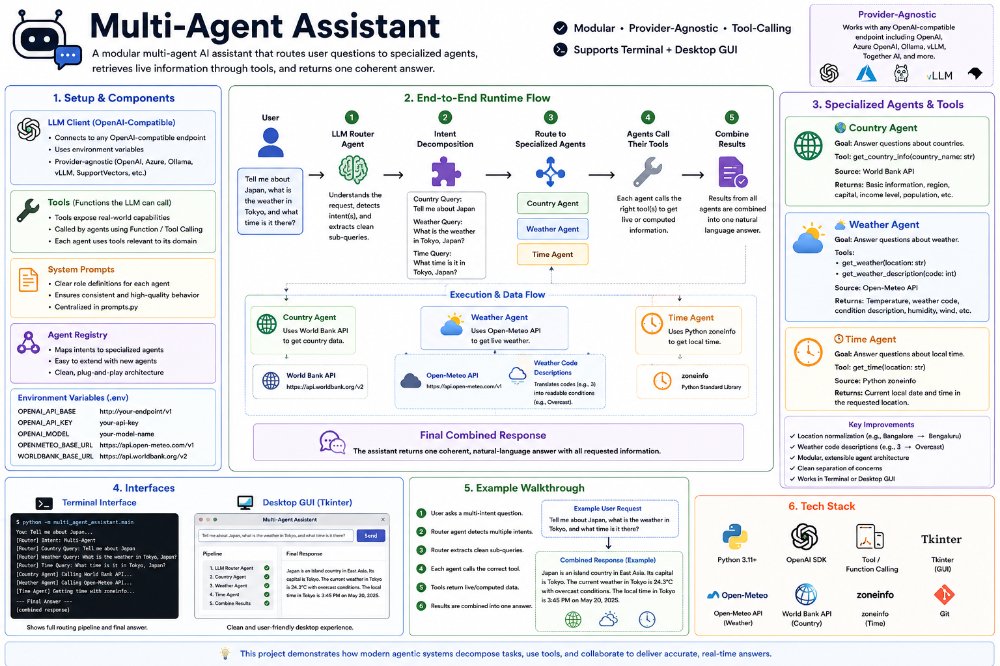

# 🤖 Multi-Agent Assistant

A multi-agent AI assistant that routes user requests to specialized agents — Weather, Country, and Time — executes them in parallel, validates their outputs, and merges everything into one natural-language answer.

Built with an OpenAI-compatible LLM, function calling, and a provider-agnostic client that works with OpenAI, Azure OpenAI, Ollama, vLLM, Together AI, and similar endpoints.



---

## Why this project

Most single-prompt assistants either hallucinate facts or can't handle requests that span multiple domains at once. This project decomposes a request into independent sub-tasks, routes each to a domain-specific agent backed by a real API, runs them concurrently, and validates the results before responding — a small but complete pattern for practical agent orchestration.

* **LLM router** classifies intent and extracts clean sub-queries per domain
* **Three specialized agents** — Weather (Open-Meteo), Country (World Bank API), Time (`zoneinfo`)
* **Parallel execution** via `ThreadPoolExecutor` for independent sub-tasks
* **Deterministic validation layer** checks agent outputs before the final response is built
* **Location disambiguation** — aliases, country/state matching, and population-based scoring (e.g. `Bangalore` → `Bengaluru, Karnataka, India`)
* **Terminal and Tkinter GUI** interfaces on the same backend
* **22 passing pytest tests** covering tools, routing, and validation

---

## Example

**Request:**
```text
Tell me about India, what is the weather in Bangalore, and what is the current time there?
```

**Pipeline:**
```text
                User
                  │
                  ▼
           LLM Router Agent
                  │
      ┌───────────┼───────────┐
      ▼           ▼           ▼
 Country      Weather       Time
  Agent         Agent        Agent
      │           │           │
      ▼           ▼           ▼
 World Bank   Open-Meteo    zoneinfo
      └───────────┼───────────┘
                  ▼
           Validation Layer
                  │
                  ▼
          Combined Response
```

**Result:** the assistant pulls country data from the World Bank API, live weather from Open-Meteo (normalizing `Bangalore` → `Bengaluru` and translating weather codes like `3` → `Overcast`), and local time via `zoneinfo` — then validates and merges all three into one answer.

---

## Project Structure

```text
multi-agent-assistant/
├── README.md
├── requirements.txt
├── .env.example
├── docs/
│   ├── ARCHITECTURE.md      # Deep dive: design decisions, message flow, prompts
│   └── architecture.png
├── tests/
│   ├── test_weather_tools.py
│   ├── test_time_tools.py
│   └── test_validator.py
└── multi_agent_assistant/
    ├── main.py              # Terminal entry point and orchestration
    ├── main_gui.py          # Tkinter desktop GUI entry point
    ├── router.py            # LLM router and task decomposition
    ├── prompts.py           # Centralized system prompts
    ├── validators.py        # Output validation layer
    ├── agents/
    │   ├── weather_agent.py
    │   ├── country_agent.py
    │   └── time_agent.py
    └── tools/
        ├── weather_tools.py
        ├── country_tools.py
        └── time_tools.py
```

---

## Installation

```bash
git clone https://github.com/asim-aa/multi-agent-assistant.git
cd multi-agent-assistant

python3 -m venv .venv
source .venv/bin/activate      # Windows: .venv\Scripts\activate

pip install -r requirements.txt
```

Copy `.env.example` to `.env` and set your endpoint:

```env
LLM_API_BASE=https://api.openai.com/v1
LLM_API_KEY=your_api_key
LLM_MODEL=gpt-4o-mini
```

Any OpenAI-compatible endpoint works, including local/private ones:

```env
LLM_API_BASE=http://your-openai-compatible-endpoint/v1
LLM_API_KEY=dummy-key
LLM_MODEL=your-model-name
```

---

## Usage

```bash
# Terminal interface — shows router decision, parallel execution, and validation
python -m multi_agent_assistant.main

# Desktop GUI (same backend, Tkinter front end)
python -m multi_agent_assistant.main_gui
```

Try: `Tell me about India, what is the weather in Bangalore, and what is the current time there?`

---

## Testing

```bash
python -m pytest -q
```

Covers weather-code parsing, location normalization, country/state matching, location scoring, validation-layer behavior, and time-tool behavior.

```text
22 passed
```

---

## Engineering Decisions

**Router over monolithic prompting.** Rather than answering directly, the router only classifies intent and extracts sub-queries, then delegates to an agent registry (`{"weather": run_weather_agent, ...}`) instead of a growing `if/elif` chain — adding an agent means adding a tool, an agent, and a registry entry.

**Parallel execution for independent sub-tasks.** When a request spans multiple domains, agent calls run concurrently via `ThreadPoolExecutor` instead of sequentially, since the Country, Weather, and Time agents don't depend on each other's output.

**Deterministic validation, not a revision loop.** After agents run, a lightweight validation layer checks for empty responses, tool failures, and missing fields (weather details, country details, time-zone info) before the final answer is assembled — intentionally simple rather than an adversarial reviewer.

**Tool calling over model memory.** All live data — weather, country stats, time — comes from real APIs (Open-Meteo, World Bank, `zoneinfo`) rather than the model's internal knowledge, reducing hallucination risk.

For the full walkthrough — message flow, prompt design, router output schema, and location-disambiguation logic — see [`docs/ARCHITECTURE.md`](docs/ARCHITECTURE.md).

---

## Technologies

Python · OpenAI-Compatible Chat Completions API · Function/Tool Calling · Tkinter · Requests · python-dotenv · Pytest · Open-Meteo API · World Bank Country API · `zoneinfo` · `ThreadPoolExecutor`

---

## Future Improvements

Conversation memory · Streaming responses · Docker deployment · FastAPI/Streamlit web interface · Router evaluation suite · Logging and telemetry · Async-native implementation with `asyncio` · Additional agents (Currency, News, Travel, Public Holidays)

---

## License

Provided for educational and portfolio purposes.
